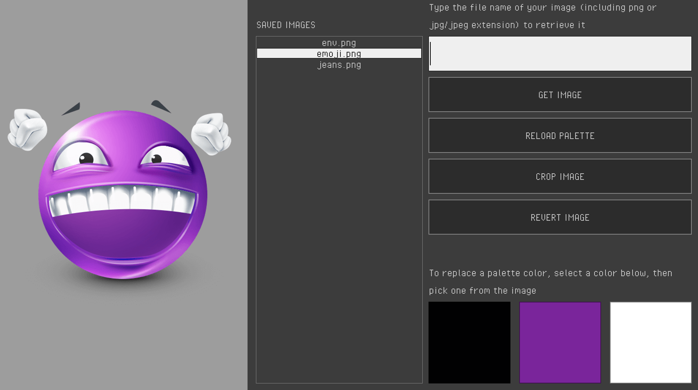

# Image Manipulation Engine

This is WiP engine for image manipulation built in raylib, intended for integration in a future project. It includes features such as:
- File upload and storage
- Cropping
- Color palette generation
- Color picking
- Reverting colors and crops

### The ``main`` repository is not yet intended for release.
